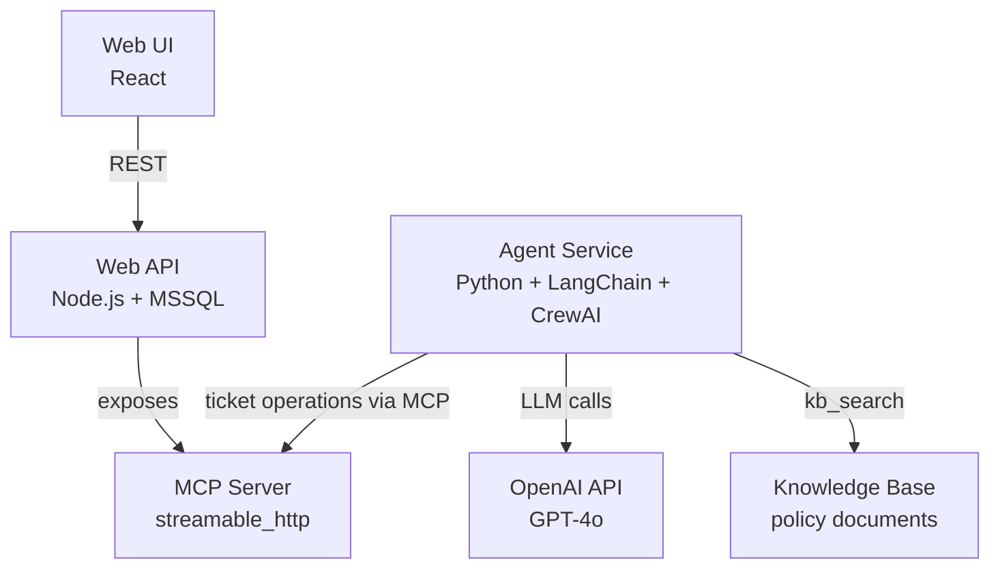

# AI-Powered Support Ticketing System

A full-stack support ticketing platform where AI agents participate alongside humans — generating realistic tickets, categorizing and autocompleting threads, and drafting replies autonomously.

---

## Services

| Service | Tech | Description |
|---|---|---|
| **Web UI** | React (Figma Make) | Support ticketing interface for human agents |
| **Web API** | Node.js + MSSQL | Core backend — serves the UI and exposes an MCP server for AI agents |
| **Agent Service** | Python + LangChain + CrewAI | Single service exposing all four AI agents via HTTP |

---

## Agent Service Capabilities

All agents live in one Python service (`src/agent/TicketCreatorAgent`). Each runs as a background job — endpoints return `202 Accepted` immediately with a `jobId` to poll.

Agents handle the full ticket lifecycle: generating realistic tickets, categorizing open threads, auto-closing inactive or resolved ones, and drafting context-aware replies grounded in a knowledge base. LangChain powers the structured single-call agents; CrewAI powers the multi-step reply workflow.

---

## Architecture

---

## How It Works

**Shared MCP Interface**
The Web API doubles as an MCP server over `streamable_http`. This single interface gives all AI agents structured, tool-based access to the ticketing system without any bespoke integration per agent.
