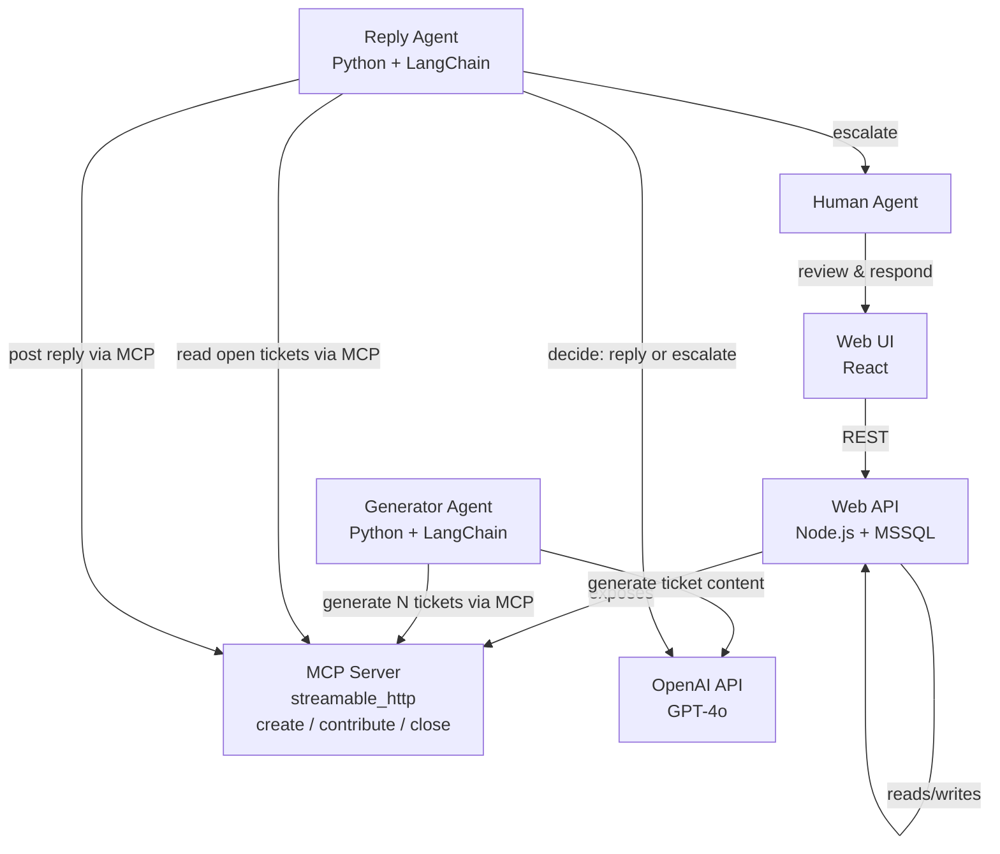

# AI-Powered Support Ticketing System

A full-stack support ticketing platform where AI agents participate alongside humans — generating realistic tickets, drafting replies autonomously, and escalating to a human when needed.

---

## Services

| Service | Tech | Description |
|---|---|---|
| **Web UI** | React (Figma Make) | Support ticketing interface for human agents |
| **Web API** | Node.js + MSSQL | Core backend — serves the UI and exposes an MCP server for AI agents |
| **Generator Agent** | Python + LangChain | Creates batches of realistic support tickets via MCP |
| **Reply Agent** | Python + LangChain | Reads open tickets and either replies autonomously or escalates to a human |

---

## Architecture

---

## How It Works

**1. Ticket Generation**
The Generator Agent is invoked with a theme and a ticket count. It calls ChatGPT once to produce a batch of varied, realistic tickets, then submits each one to the ticketing system through the MCP server.

**2. Ticket Handling**
The Reply Agent monitors open tickets. For each one it asks ChatGPT whether it can confidently resolve the issue. If yes, it posts a reply and closes the ticket via MCP. If not, it flags the ticket for a human agent to handle.

**3. Human-in-the-Loop**
Human agents work through the Web UI — reviewing escalated tickets, posting responses, and closing resolved threads. The same underlying API serves both humans and AI agents.

**4. Shared MCP Interface**
The Web API doubles as an MCP server over `streamable_http`. This single interface gives AI agents structured, tool-based access to the ticketing system without any bespoke integration per agent.
